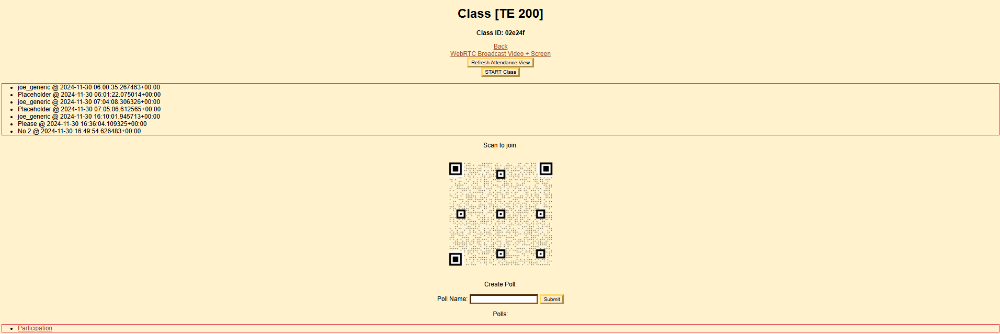

# TE-200
## Class Chime

Class Chime is a prototype courseware solution developed as a final project for Introduction to Innovation (TE 200) at UIUC.  
This repo contains an implementation with the following features:
- Account Creation
- Class Creation
- Attendance
- Polling
- QR Code Generation
- P2P Webcam + Screen + Microphone Streaming

> [!Warning]
> No part of this codebase is intended for a production environment. This project was developed **in haste** solely for the purpose of having an MVP prototype.



## Usage
```bash
# Install dependencies.
pip install -r requirements.txt # Django, dotenv
npm install # RTCMultiConnection-Server

# Install WebRTC signaling server.
./scripts/install_signaling_server.sh
```
Create a `.env` file:
```bash
SIGNALING_SERVER_URL="<insert signaling server url here>"
LOGGING="ON"
```
> You may need to proceed to the following steps to determine the signaling server's URL.
```bash
# Start WebRTC signaling server and Django development server.
./scripts/start.sh

# Visit port 8000.
# Port 9001 is for the signaling server.
```
> [!Note]
> The signaling server accepts requests from **all origins**. Be sure that the signaling server is accessible via browser requests. This means making forwarded ports public if applicable.
